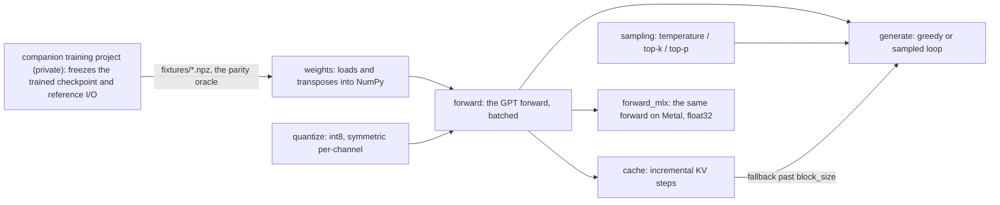

# personacore-np

An inference engine for a 13.9M-parameter GPT, written from scratch: pure NumPy
on the forward path, with an optional MLX backend for the Apple GPU. No PyTorch,
no framework. Arrays, and the arithmetic the model needs at inference time.

## Why it exists

This is the serving half of a from-scratch stack. The weights come out of a
companion training project (private); this repository proves they can be served
correctly without any of the machinery that trained them.

## Status

| Milestone | What it proves | Central number |
|---|---|---|
| **M0** forward pass | Logits match a frozen PyTorch oracle, float64 | rel. error 2.52e-15, against a bound of 2.4e-13 derived before measuring; loss bit-identical |
| **M1** greedy generation | Token-for-token identical to the reference `generate()` | exact at 20 tokens and at 280, crossing `block_size` |
| **M2** KV-cache | Incremental cache while the window fits, full recompute after | 20x inside the window (7999 ms → 403 ms); 39x per step at the boundary |
| **M3** batched forward | Right-padding needs no padding mask | perturbing the pad region moves real logits by exactly 0.000e+00 |
| **M4** sampling | temperature / top-k / top-p replicate the source's edge conventions | property tests only; no seed makes two RNG algorithms agree |
| **M5** int8 quantization | Symmetric per-channel scheme, chosen from measured weight statistics | perplexity 2.4280 → 2.4270; a deliberate int4 control lands at 2.5928; weights 7.95x smaller |
| **M6** MLX backend | The same forward on the GPU (M3 Pro), float32 | 63.11 ms → 4.19 ms per 256-token forward, 15.07x |

Suite: **86 passed**. Mutation artifact: **78 mutations, 72 killed, 6 alive**,
each survivor justified below.

## Where this repo sits



This repository assumes the fixtures already exist, generated once and
elsewhere from the private checkpoint. It produces everything downstream of
them: the forward, the generation paths, and the proofs that they match the
oracle.

## Engineering discipline

- **TDD, red-first, every cycle.** No production code before a failing test.
  Where a genuine red was structurally unavailable (the oracle already
  existed), a revert cycle replaced it: break the code, watch the test die,
  restore.
- **Tolerances derived in writing before measuring.** The M0 bound comes from a
  term-count model of the critical path; the measured error came in ~95x below
  it, and a canary was then pinned near the measured value to catch drift. No
  tolerance was ever loosened to make a test pass.
- **Manual, directed mutation testing.** Manual is a choice here, not a
  shortcut: each of the 78 mutations attacks one named architectural decision
  (ddof in the variance, eps inside vs. outside the sqrt, mask-before-softmax,
  crop direction, cache position index, quantization scale, MLX axis order). An
  automatic mutator generates hundreds of trivial mutants and none of these.
- **Every surviving mutant is justified in writing** — proven mathematically
  equivalent, or shown structurally unreachable. None accepted on a shrug:

  | Survivor | Why it lives |
  |---|---|
  | `GE-3` (M1) | Dead store: appends to a local right before a `return` that never reads it |
  | `KV-5` (M2) | No target. The cache path has no causal mask to break — everything cached is strictly past |
  | `KV-7` (M2) | Equivalent: attention is a permutation-invariant weighted sum, and position is baked into K,V at creation |
  | `PD-6` (M3) | No target. Cross-row isolation is not a line of code — it is what `@` means on arrays with leading axes |
  | `QT-2` (M5) | Equivalent: with the max-based scale, `\|w/s\| ≤ 127/(1−2⁻²⁴)`, which rounds to 127 — the clip cannot fire |
  | `MX-3` (M6) | No target. No operation was found where MLX broadcasting diverges from NumPy |

## Findings

**The planned cache architecture was mathematically wrong.** The original plan
was to invalidate the KV-cache every `block_size` steps. With learned absolute
positional embeddings (no RoPE), that is not how the model behaves: once the
window slides, every surviving token shifts one slot in `wpe`, so the cache is
stale after *every* step, and rebuilding it costs a full forward anyway. The
derivation that caught this was written before any cache code existed. The
shipped design caches while the window fits and hands the rest of the
generation to the uncached path.

**The padding mask never needed to exist.** Batching pads sequences to a
rectangle, and the textbook fix is a padding mask, because `exp(score_pad)`
stays in the softmax denominator. With right-padding, every pad position sits
in the causal future of every real query, so the causal mask already blocks
it. Measured, not assumed: rewriting the pad region with arbitrary tokens
moves the real logits by exactly 0.000e+00, while the same perturbation under
left-padding moves them by 7.399e-01. The milestone's most valuable output was
negative: the code the original spec asked for would have been provably dead.
About 6 lines of production code shipped; the rest is proof.

**The reference implementation's docstring is wrong about its own code.** The
upstream sampling docstring claims `temperature == 0` is routed to a greedy
branch. That branch does not exist anywhere in the source; what actually runs
is division by a floor of 1e-8, which sharpens the distribution instead. This
engine replicates the code, not the comment, and the test suite documents the
difference.

## Known limitations

- The incremental cache only helps within `block_size`; past that it degrades
  to the uncached path's speed. That is a structural limit of absolute learned
  positional embeddings, not a bug (see the first finding).
- `cross_entropy` is single-sequence while `gpt_forward` accepts a batch. A
  known asymmetry with no consumer that needs it today.
- Sampling is not wired into the cached path: `generate_with_cache` is
  greedy-only, by design. Its post-crop fallback re-enters the M1 path, which
  would leave the head of a long generation greedy and the tail sampled.
- MLX ports only the forward. Cache and sampling stay in NumPy because they
  are light bookkeeping the GPU would not accelerate. The decision is
  recorded; it can be revisited if interactive generation becomes the product.

## Reproduction

The parity fixtures (~157 MB of `.npz`) derive from a trained checkpoint that
lives in a private companion repository. Without access to it, this suite runs

```
30 passed, 56 skipped
```

The pure-NumPy unit tests pass, and every parity test skips with a message
naming the generator that would produce its fixture. The parity numbers quoted
above are real, but you cannot re-derive them without the private checkpoint.
That is the honest limit of what this repository reproduces on its own. With
the fixtures in place, the full suite is `86 passed`.

The MLX tests additionally need Apple Silicon and the optional extra
(`pip install -e ".[mlx]"`); without it they skip.

## Running it

```bash
pip install -e ".[dev]"
python -m pytest                    # 86 passed (with fixtures), ~17s
python scripts/mutation_check.py    # 78 mutations, 72 killed, 6 alive, ~6min
```
